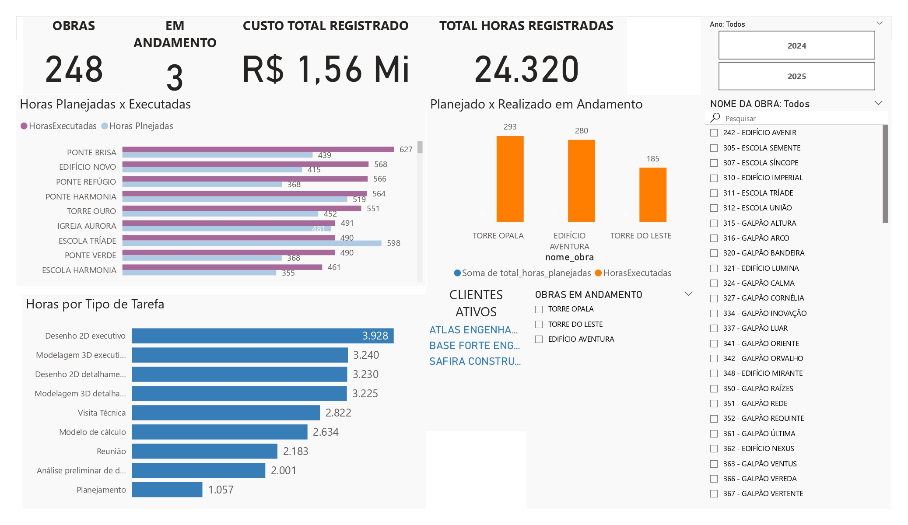
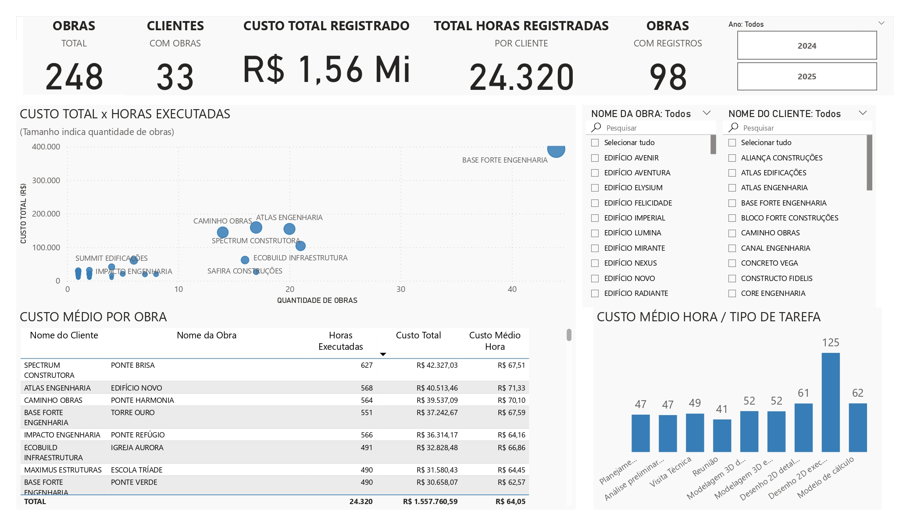
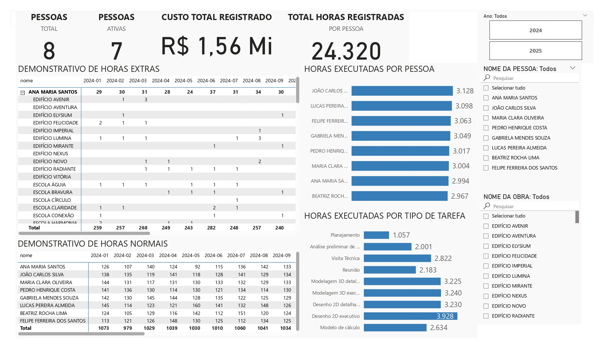

# Painel (Dashboard) de Visualização de Dados com PowerBI

## Análise e visualização de dados com PowerBI - custos de um escritório de projetos de Engenharia

## Resumo

O código desse repositório tem por objetivo analisar registros de horas gastas na elaboração de projetos estruturais de Engenharia Civil, classificadas por tipo de tarefa, utilizando o PowerBI. Neste cenário, são analisados os dados de custos em diferentes visões, para auxiliar na tomada de decisões gerenciais.  
Todos os dados são fictícios, porém coerentes com a realidade de um escritório de projetos.  
  
O projeto usa um banco de dados Postgres hospedado no servidor local.  
  
## Ferramentas utilizadas
| Banco de Dados | Geração de dados fictícios | 
|:--------------:|:-----------:|
|  **Postgres** |     **Python** |

## Visões
Foram criadas 3 visões para apresentar os dados em diferentes perspectivas:
* Geral: visão geral dos projetos, com dados macro;  
* Cliente: visão dos projetos por cliente;  
* Pessoa: visão dos custos e participação dos colaboradores.  

## Geração dos dados fictícios
Os dados foram gerados com auxílio de modelos de linguagem (LLM) para geração dos nomes de clientes, funcionários e obras; e usando numpy para criar dados aleatórios com algumas premissas, para que pudessem ser adaptados à estrutura do banco de dados existente, e refletindo um perfil de dados coerente com a realidade de um escritório de projetos.  
A biblioteca numpy permite a criação de número aleatórios, porém atendendo a determinados critérios. Alguns dos critérios adotados foram:  
- horário dos registros: registros somente no horário comercial (08:00 - 17:00);  
- horas extras: 20% dos registros foram classificados como hora extra;  
- perfil de funcionário: foram estipulados perfis de trabalho para cada funcionário, para que as tarefas registradas fossem restritas a uma determinada proporção entre as tarefas classificadas.  
Foram gerados dados equivalente à produção de 18 meses de trabalho, com uma equipe formada por 8 profissionais, num total de 24320 registros.
  
Todos os registros foram salvos num banco de dados, e conectado ao PowerBI.  
Apesar de ser possível fazer algumas consolidações e agrupamentos diretamente no banco de dados usando SQL, optou-se por fazer as transformações de dados diretamente no PowerBI, visando explorar as funcionalidades desse software.  

**Visão 01 - Geral**  
  

**Visão 02 - Cliente**  
  

**Visão 03 - Funcionários**  
  
